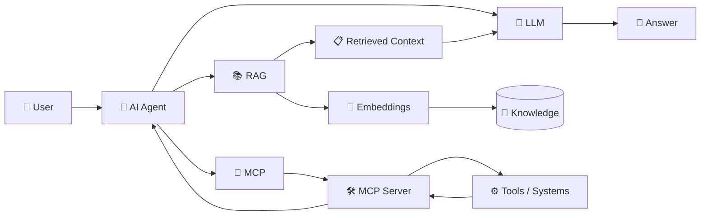
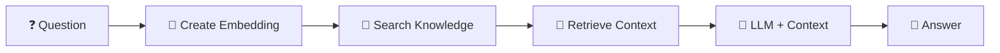
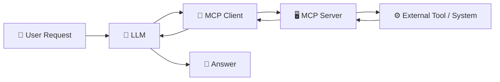
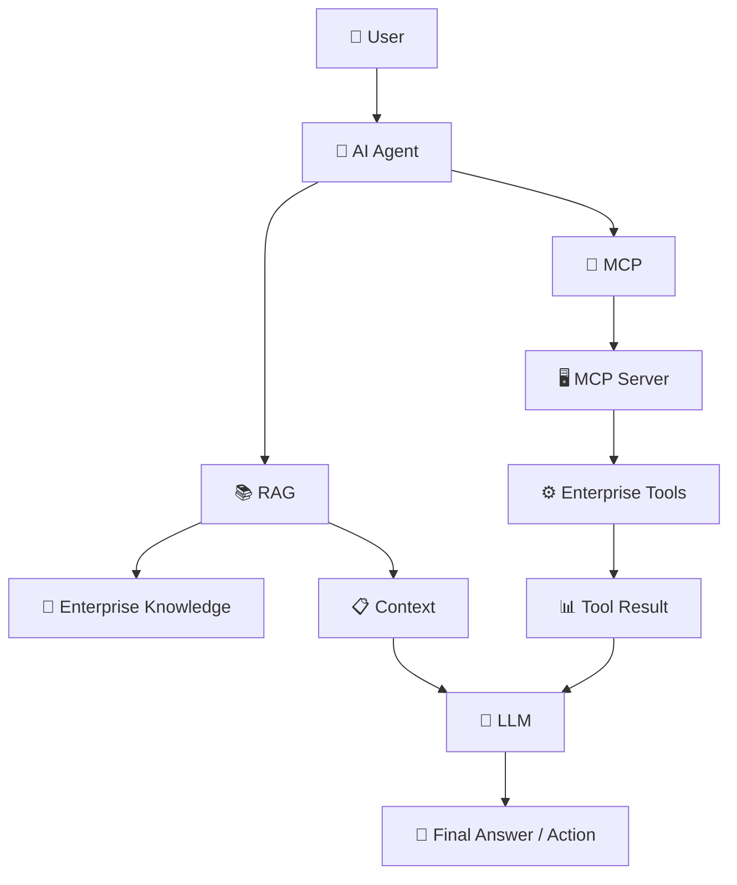

# 🤖 AI Agent

<p align="center">
  <strong>A practical Python AI Agent learning project — from LLM basics to RAG and MCP.</strong>
</p>

<p align="center">
  <a href="https://github.com/amitweb2012/ai-agent/stargazers"></a>
  <a href="https://github.com/amitweb2012/ai-agent/network/members"></a>
  <a href="https://github.com/amitweb2012/ai-agent/blob/main/LICENSE"></a>
  
  
  
</p>

<p align="center">
  <a href="#-what-this-project-teaches">What you'll learn</a> •
  <a href="#-architecture">Architecture</a> •
  <a href="#-quick-start">Quick start</a> •
  <a href="#-rag-and-mcp-the-idea">RAG vs MCP</a> •
  <a href="#-project-structure">Structure</a>
</p>

---

## 🎯 What This Project Teaches

This repository is based on the original local **AI-AGENT** implementation and is organized as a hands-on path for learning how modern AI agents work.

| 🧩 Module | What it demonstrates |
|---|---|
| 🟢 **Basic Agent** | LLM calls, personas, prompts and deterministic tools |
| 📚 **RAG** | Embeddings, similarity search, retrieval and grounded generation |
| 🔌 **MCP** | MCP server/client, tool discovery and tool execution |
| 🧪 **Tests** | Deterministic tool, routing and retrieval tests |
| ⚙️ **Configuration** | OpenAI-compatible endpoints and local Ollama setup |

## 🏗️ Architecture

The project progresses from a simple LLM call to an agent that can retrieve knowledge and use external tools.



> **Simple mental model:** RAG gives the agent **knowledge**; MCP gives the agent **capabilities**.

---

## 🧰 Tech Stack

<p>
  
  
  
  
  
  
</p>

---

## ⚡ Quick Start

### 1. Prerequisites

- Python **3.12+**
- [uv](https://docs.astral.sh/uv/)
- [Ollama](https://ollama.com/) for the default local setup

Pull the example models:

```bash
ollama pull qwen3:1.7b
ollama pull nomic-embed-text
```

### 2. Install

```bash
git clone https://github.com/amitweb2012/ai-agent.git
cd ai-agent

uv sync --extra dev
cp .env.example .env
```

Default configuration:

```env
BASE_URL=http://localhost:11434/v1
API_KEY=ollama
MODEL=qwen3:1.7b
EMBEDDING_MODEL=nomic-embed-text
RAG_MIN_SIMILARITY=0.5
```

> 🔐 Never commit a real `.env` file or API keys.

---

## ▶️ Run the Examples

### 🟢 Basic AI Assistant

```bash
uv run ai-basic
```

Available personas:

- 👨‍🏫 Teacher
- 🐍 Python Expert
- ✈️ Travel Guide
- 💪 Motivational Coach
- 🎯 Interviewer

Example tool requests:

```text
What time is it?
Roll a dice
Generate a password
Explain notes.txt
Summarize project.txt
```

### 💬 Simple LLM Call

```bash
uv run python -m ai_agent.basic.hello
```

### 📚 RAG Assistant

```bash
uv run ai-rag
```

Knowledge files are stored in:

```text
src/ai_agent/rag/knowledge/
```

### 🔌 MCP Server + Agent

**Terminal 1 — start the MCP server**

```bash
uv run ai-mcp-server
```

**Terminal 2 — start the AI agent**

```bash
uv run ai-mcp-agent
```

The MCP server exposes tools such as:

```text
current_time
roll_dice
generate_password
```

---

# 🧠 RAG and MCP — The Idea

**RAG (Retrieval-Augmented Generation)** and **MCP (Model Context Protocol)** solve different problems in an AI system.

## 📚 RAG — Give the AI Knowledge

RAG is mainly about giving an LLM **relevant information from external knowledge** before it generates an answer.



Typical sources:

- Company policies
- Documentation
- Manuals
- Knowledge bases
- Product information

**Think of RAG as:**

> 📚 **“Find the right information and give it to the LLM.”**

---

## 🔌 MCP — Give the AI Capabilities

MCP is mainly about giving an AI application a **standard way to discover and use external tools and capabilities**.



Typical capabilities:

- Call APIs
- Query databases
- Read files
- Create tickets
- Access SaaS systems
- Execute business operations

**Think of MCP as:**

> 🔌 **“Give the AI a standard way to use tools and systems.”**

---

## ⚖️ RAG vs MCP

| | 📚 RAG | 🔌 MCP |
|---|---|---|
| **Main purpose** | Retrieve knowledge | Connect AI to tools/systems |
| **Gives the AI** | Information / context | Capabilities / actions |
| **Typical use** | Documents, policies, manuals, knowledge bases | APIs, databases, SaaS tools, files, business systems |
| **Core idea** | Search → retrieve → generate | Discover → call tool → receive result |
| **Example** | “What is our leave policy?” | “Create a leave request.” |
| **Nature** | Usually read-oriented | Read or write/action-oriented |

### 🤝 They Work Together

RAG and MCP are **not competing technologies**. A production AI agent can use both.



**Enterprise example:**

> An HR assistant can use **RAG** to retrieve the company's leave policy and **MCP** to call the HR system when the employee asks to submit a leave request.

---

## 🧪 Testing

Run the test suite:

```bash
uv run pytest
```

The tests cover deterministic tools, tool routing, cosine similarity and knowledge loading. LLM-dependent examples require a running Ollama-compatible endpoint.

---

## 📁 Project Structure

```text
ai-agent/
├── 📄 README.md
├── 📦 pyproject.toml
├── 🔐 .env.example
├── 📚 docs/
│   ├── installation.md
│   ├── architecture.md
│   ├── basic-agent.md
│   ├── rag.md
│   ├── mcp.md
│   ├── development.md
│   ├── testing.md
│   └── roadmap.md
├── 🧠 src/
│   └── ai_agent/
│       ├── basic/
│       ├── data/
│       ├── mcp/
│       └── rag/
└── 🧪 tests/
```

---

## ⚙️ Configuration

The project uses the OpenAI Python SDK against an **OpenAI-compatible endpoint**, so Ollama can be replaced by another compatible provider.

```env
BASE_URL=https://provider.example/v1
API_KEY=your-key
MODEL=your-model
EMBEDDING_MODEL=your-embedding-model
```

---

## 🛠️ Troubleshooting

### Connection refused on port 11434

Start Ollama and verify that the service is running.

### Model not found

```bash
ollama pull qwen3:1.7b
```

### Embedding model not found

```bash
ollama pull nomic-embed-text
```

### Import errors

Run commands from the repository root through `uv`.

---

## 📖 Documentation

| 📄 Document | Purpose |
|---|---|
| [Installation](docs/installation.md) | Setup and local environment |
| [Architecture](docs/architecture.md) | Overall design |
| [Basic Agent](docs/basic-agent.md) | LLM, personas and tools |
| [RAG](docs/rag.md) | Embeddings, retrieval and grounding |
| [MCP](docs/mcp.md) | MCP server/client and tools |
| [Development](docs/development.md) | Development workflow |
| [Testing](docs/testing.md) | Test strategy |
| [Roadmap](docs/roadmap.md) | Learning and production evolution |

---

## 🚀 Learning Path

```text
LLM Basics
   ↓
Prompting + Personas
   ↓
Tool Calling Concepts
   ↓
Embeddings
   ↓
RAG
   ↓
MCP
   ↓
Agent Orchestration
   ↓
Production AI Systems
```

---

## ⭐ Why This Repository?

This project is intentionally structured as a **learning-to-production path** rather than a single black-box agent.

It helps you understand:

- 🧠 How an LLM interacts with an application
- 🛠️ How tools extend an agent's capabilities
- 📚 How RAG supplies external knowledge
- 🔌 How MCP standardizes tool connectivity
- 🧪 How deterministic components can be tested independently
- 🏗️ How the architecture can evolve toward enterprise AI systems

---

## 📜 License

MIT

<p align="center">
  <sub>Built for learning, experimentation, and production-oriented AI engineering.</sub>
</p>
